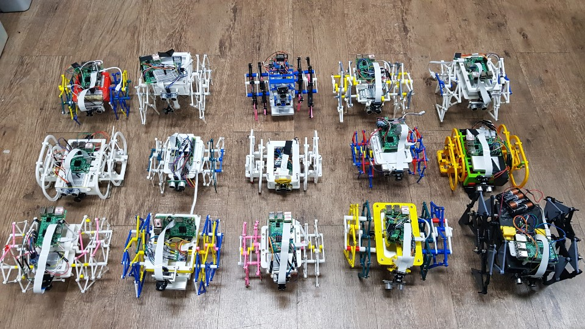

Self-Driving Walking Robot Project
===

The first version of autonomous walking robot project.
Additional Codes : https://github.com/kbdlab/walking_robot

This project is the first version of <Creative Design 2> 2018 lecture in Yonsei University, South Korea. 
Woojin Jo and Hojoon Son are contributed as TA and they made the whole concept for this project.

Reference
---
https://github.com/hamuchiwa/AutoRCCar

V-rep Simulation
---

Contest 
---
2018-Video :  
https://www.youtube.com/watch?v=WI1AsNgTEiM&t=1465s  
https://www.youtube.com/watch?v=ctutxYvwzw4&t=1611s

2019-Video :  
https://www.youtube.com/watch?v=2_rieY8TjQg

Robot Images
---

Email
---
Email : hojoonson@yonsei.ac.kr 
Email : e05062@yonsei.ac.kr
